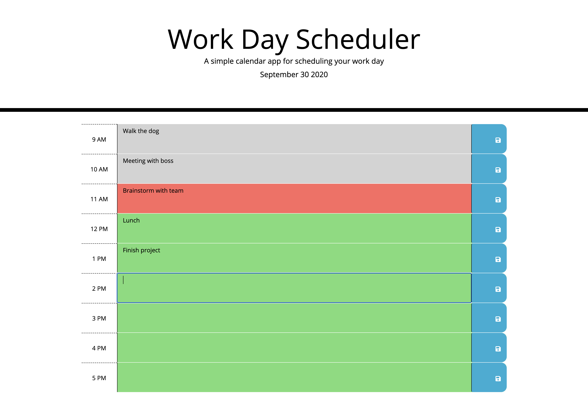

# Workday Scheduler

## Deployed

[Access the deployed web application here.](https://christinakerr.github.io/WorkdayScheduler/)

## Purpose

Manage your workday more effectively with this daily planner. It breaks up the workday into single hour chunks, which contain important events and tasks. Keep track of your events at a glance with color coding for previous hours, current hour, and future hour.

You can easily make changes to your schedule by clicking the text boxes to edit and clicking the save button to the right. All saved events are stored for the next time you open the page.

## Tech

This application leverages:

* HTML
* CSS
* Bootstrap
* JavaScript
* jQuery
* Moment.js

